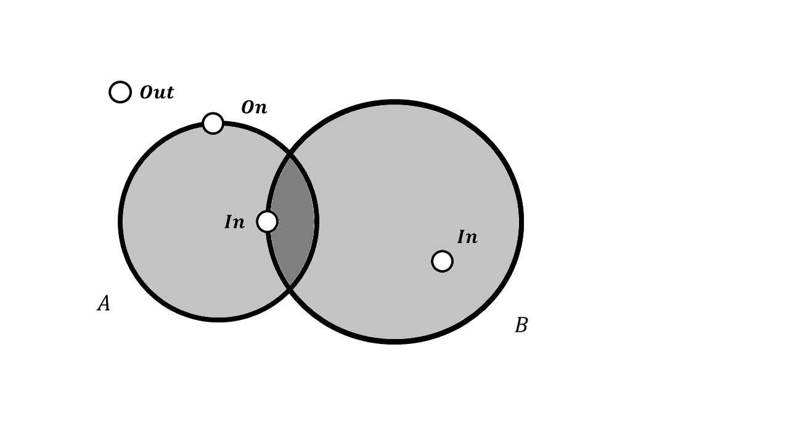
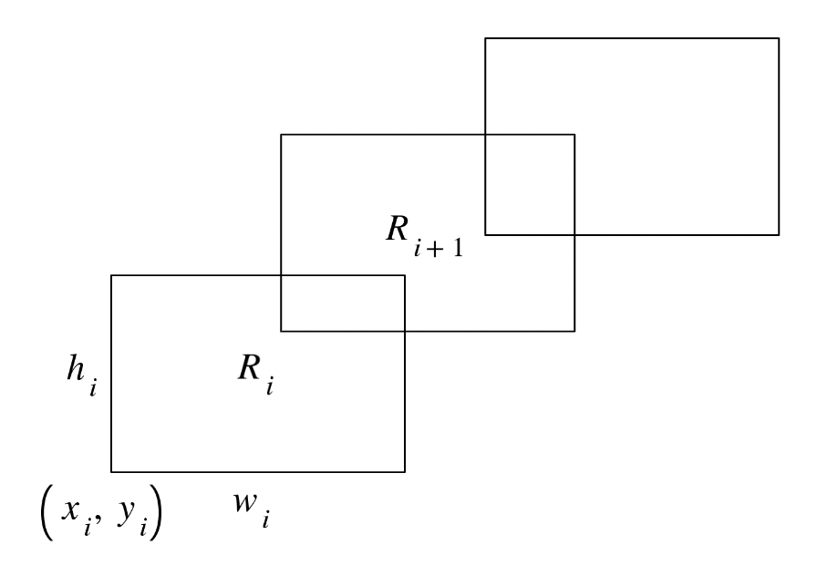

# 112-1 計算機程式設計 Quiz 1 題解

- 主題：運算、條件式、迴圈
- 雙數班(CSIE1210 02班)：2023/09/11(一) 2,3,4節(09:10-12:10)、後3題(10366-10368)
- 單數班(CSIE1210 01班)：2023/09/12(二) 7,8,9節(14:20-17:20)、前3題(10363-10365)

## 考前公告們

### Quiz 1 (2023年9月7日 上午11:43)
> This is a reminder that we will have a quiz next week. The quiz covers
> computation, branch, and loop. You can bring a reference book (not necessarily
> the textbook) and no other materials for the quiz.

### Quiz 1 (2023年9月8日 上午11:21)
> I would like to remind you that the focus of this quiz is computation and loop
> control, not array or any topic that has not been covered yet. As a result, we
> will design the tasks so that if you use an array it will cause memory
> problems. Please keep this in mind. Also, we will not allow global memory and
> goto.

## 前言

本週的考試內容是基礎計算、條件式和迴圈。必須特別注意的點在於「迴圈」，因為出題者會故意卡記憶體，導致不能使用陣列，要強迫自己想出空間複雜度 $O(1)$ 的解。

如果題目中的運算只會到**這一筆**資料跟**上一筆**資料，那其實不用陣列就可以解決了！很典型的手法是：把上一筆資料儲存在一個變數，用上一筆資料與這一筆資料進行運算，算完之後再把上一筆資料的變數用這一筆資料更新即可。講到這應該很多人都已經發現了，本次考試的好幾題都是使用到這個觀念。

以上的說法可能比較抽象，我們舉一個很簡單的實例：
> 給定一個 $n$ 個整數的數列 $a$ ，請輸出所有相鄰兩數的乘積。
>
> 輸入：第一行有一個整數 $n$ ，代表接下來會有 $n$ 個整數。第二行有 $n$ 個以空白分隔的整數，第 $i$ 個數為 $a_i$ 。
>
> 輸出： $n-1$ 行，第 $i$ 行的整數為 $a_i$ 與 $a_{i+1}$ 的乘積 。
>
> 範例輸入：
> ```
> 5
> 2 5 3 7 1
> ```
>
> 範例輸出：
> ```
> 10
> 15
> 21
> 7
> ```

我們可以發現，要求出答案的第 $i$ 個數，只會用到 $a_i$ 和 $a_{i+1}$ 兩筆資料。如果我們把 $a_i$ 定為「上一筆資料」， $a_{i+1}$ 定為「這一筆資料」，不就搞定了嗎！只要先吃進第一個數(本例中為2)當作`last(上一個數)`的初始值，接著我們就可以用一個for迴圈跑 $n-1$ 次，每次都先吃進`now(現在的數)`，跟`last`相乘並輸出答案，最後記得把`last`用`now`更新，進入到下一次迴圈，對吧！

```c
#include <stdio.h>

int main() {
  int n;
  scanf("%d", &n);

  int last;
  scanf("%d", &last);  // Takes first number as initial value of `last`.
  for (int i = 1; i < n; ++i) {  // `i` loops from 1 to (n - 1).
    int now;
    scanf("%d", &now);
    printf("%d\n", last * now);
    last = now;  // Update `last` with `now`.
  }
  return 0;
}
```

有了以上的概念後，讓我們正式進入到本週的考題吧！

## 詳解

### 10363. Areas of a Polygon

給定一多邊形 $P$ 的 $n$ 個頂點 $(x_i, y_i)$ ，請以[行列式](https://en.wikipedia.org/wiki/Shoelace_formula)求出此多邊形面積的兩倍。頂點已依逆時針方向排序，且不可用陣列儲存頂點的座標。

$$
2A =
\begin{vmatrix}
x_1&x_2 \\
y_1&y_2
\end{vmatrix} +
\begin{vmatrix}
x_2&x_3 \\
y_2&y_3
\end{vmatrix} +
\cdot \cdot \cdot +
\begin{vmatrix}
x_n&x_1 \\
y_n&y_1
\end{vmatrix}
$$

⚡ 一言以蔽之：利用前言中提到的手法，一個一個行列式計算。最後一個行列式特別處理。

⌨ 實作細節([參考AC code](10363.%20Area%20of%20a%20Polygon.c))：
1. 一開始先吃進第一組座標 ，作為「上一筆資料」`x1`、`y1`的初始值。特別注意，在本題中這一筆資料要另外存起來，因為最後還會用到。
2. 接下來使用for迴圈，每次吃進一組座標`x2`、`y2`，計算行列式並加到答案。如此一來，第`i`次(1-based)迴圈的`x1`、`y1`、`x2`、`y2`就是題目敘述中的 $x_{i-1}$ 、 $y_{i-1}$ 、 $x_i$ 、 $y_i$ ，這樣就只有用到4個變數而不須用到陣列。算完後把`x2`、`y2`的值分別丟給`x1`、`y1` ，為下一次計算做好準備。
3. 全部 $n-1$ 次迴圈跑完後，此時的`x1`、`y1`應為題目敘述中的 $x_n$ 、 $y_n$ 。此時利用第1步存下來的`x_first`、`y_first`計算最後一個行列式並加到答案。

⭐ 難度：2 / 5

💡 我的解法：時間複雜度 $O(n)$ ，空間複雜度 $O(1)$

⏳ 我花的時間：7m48s

### 10364. Consecutive Positive or Negative

給定一串非零整數的數列，計算相同正負號的整數連續出現幾個。若為一組連續 $m$ 個正數則輸出 $m$ ，而一組連續 $m$ 個負數則輸出 $-m$ 。

⚡ 一言以蔽之：一樣是用前言中提到的手法，但這次要多維護一個變數，記錄相同正負號的數字(以下簡稱同號數)個數。

⌨ 實作細節([參考AC code](10364.%20Consecutive%20Positive%20or%20Negative.c))：
1. 吃進第一個數，作為`last`的初始值。初始化同號數的個數`count`為 $1$ ，不是 $0$ 而是 $1$ 是因為`last`本身就算一個數了。
2. 持續輸入`now`直到EOF，每次要做的事情有兩種可能：
   - 如果`last`跟`now`同號，那就把`count`增加 $1$ ，這很直觀。
   - 如果`last`跟`now`異號，那就要輸出剛才那一組同號數的個數`count`。特別注意如果剛才那一組同號數是負數，則要輸出`-count`。處理完輸出後，記得把`count`重設為 $1$ 。

   考慮完這兩種可能後，別忘了用`now`的值更新`last`。
3. 特別注意，吃完所有的輸入後，最後還要再輸出一次`count`，代表最後一組同號數的個數。為何呢？因為在第2步中每次檢查到異號時，輸出的都是**前面那一組同號數**的個數，所以最後一組的同號數個數沒有機會被輸出，while迴圈就結束了。(其實有一個手法是在陣列的最後故意加一個「跟陣列原本的最後一個數異號」的任意數，強迫程式再輸出一次，但那是陣列的手法，這裡不太能用。)

⭐ 難度：2 / 5

💡 我的解法：時間複雜度 $O(n)$ ，空間複雜度 $O(1)$

⏳ 我花的時間：6m37s

### 10365. Nearest Points

給定 $A, B, C, D$ 四點座標，找出與 $D$ 點最近的點是 $A, B, C$ 中的哪幾個點。

⚡ 一言以蔽之：分別算出 $\overline{AD}$ 、 $\overline{BD}$ 、 $\overline{CD}$ 的距離後，直接用一堆if、else if炸下去。沒錯，就是這麼暴力。

⌨ 實作細節([參考AC code](10365.%20Nearest%20Points.c))：
- 兩點間距離建議用距離的平方代表，也就是不要開根號，以避免浮點數問題。
- 小心條件式不要寫爛就好了。其實題目有個出乎意料的佛心之處：如果依照表格每一列的情形一列一列往下判斷，剛好會是最乾淨的寫法之一。

⭐ 難度：1 / 5

💡 我的解法：時間複雜度 $O(n)$ ，空間複雜度 $O(1)$

⏳ 我花的時間：18m14s (因為我想說「怎麼可能直接炸一堆if」😅)

<details>
<summary>📝 題外話：</summary>
在驗題階段時，這題被某位真強者驗出測資有integer overflow的問題，用long long會錯，要用int才會對。然後助教就被邦邦嘴了，好可憐😮😥。
</details>

### 10366. 3n+1

給定一任意正整數 $n$ ，考慮以下操作：
- 若 $n$ 為偶數，將其除以 $2$ 。
- 若 $n$ 為奇數，將其 $3$ 倍後加 $1$ 。

每一步操作的結果即為下一步操作的輸入。不管最初的輸入為何，只要一直重複此操作，則 $n$ 最後一定會等於 $1$ 。請寫一支程式模擬操作的過程，直到 $n=1$ 。

⚡ 一言以蔽之：照著題目敘述做，輕鬆AC。

⌨ 實作細節([參考AC code](10366.%203n+1.c))：用一個while或do-while就解決了，注意最後還要輸出一個 $1$ 即可。也可以用另一個解法，在進入while前先輸出一次 $n$ ，然後while裡的`printf`是在運算後。

⭐ 難度：0.5 / 5

💡 我的解法：時間複雜度不知道，空間複雜度 $O(1)$

⏳ 我花的時間：4m7s

### 10367. Two Circles

分別給定 $xy$ 平面上兩圓 $A, B$ 的圓心座標 $(x_A, y_A), (x_B, y_B)$ 與半徑 $r_A, r_B$ 。接下來給你一堆點座標 $(x_i, y_i)$ ，對於每個點請判斷其位於圓內、圓上或圓外。



⚡ 一言以蔽之：國中數學的程式版。先把兩圓的座標和半徑存起來，接著每組座標判斷即可。

⌨ 實作細節([參考AC code](10367.%20Two%20Circles.c))：
- 希望大家還記得國中數學「點與圓的位置關係」：計算點到圓心的距離，小於半徑則點在圓內，等於半徑則點在圓上，大於半徑則點在圓外。
- 兩點間距離建議用距離的平方代表，也就是不要開根號，以避免浮點數問題。
- 由圖可知，當兩圓交於兩點，若我們要考慮的點落在一圓上、另一圓內，答案為`In`而非`On`。因此在寫if、else if時，建議先判斷`In`再判斷`On`，若兩者都不符合則為`Out`。

⭐ 難度：1 / 5

💡 我的解法：時間複雜度 $O(n)$ ，空間複雜度 $O(1)$

⏳ 我花的時間：10m57s (因為我驗題時還沒有那張圖，我一直在想在一圓內、在另一圓上的點到底是`In`還是`On`)

### 10368. Area of Rectangles

給定 $n$ 個長方形 $R_1, R_2, \ldots, R_n$ 。 $R_i$ 左下角的點座標為 $(x_i, y_i)$ ，寬度為 $w_i$ ，長度為 $h_i$ 。(我覺得應該改成width和length比較合理，所以我是翻成「長度」。)

任意兩連續長方形 $R_n, R_{n+1}$ 滿足以下兩性質：
1. $R_{i+1}$ 左下角的點座標 $(x_{i+1})$ 在 $R_i$ 內部。換言之， $x_i \lt x_{i+1} \lt x_i+w_i$ 且 $y_i \lt y_{i+1} \lt y_i+h_i$ 。
2. $R_{i+1}$ 的右上角在 $R_i$ 外部。 換言之， $x_{i+1}+w_{i+1} \gt x_i+w_i$ 且 $y_{i+1}+h_{i+1} \gt y_i+h_i$ 。



⚡ 一言以蔽之：又是前言中提到的手法，先處理第一個長方形，之後一個一個「Ꞁ」形處理。

⌨ 實作細節([參考AC code](10368.%20Area%20of%20Rectangles.c))：
1. 吃進第一個長方形的數據，作為「上一筆資料」`x1`、`y1`、`w1`、`h1`的初始值，並把此長方形的面積加到答案。
2. 接著跑一個 $n-1$ 次的for迴圈，每一次輸入一筆長方形的資料`x2`、`y2`、`w2`、`h2`。利用`w2`和`h2`可計算此長方形的面積，利用上一個長方形的四個數據及`x2`、`y2`可算出上一個長方形和這一個長方形重疊的面積，前者加、後者減，即可得「Ꞁ」形面積。如同以往，算完後記得把「上一個長方形」用「這一個長方形」更新。(因為題目有保證那兩個性質，這裡的運算式才可以那麼單純，否則又要刻幾個條件式，而且單次運算可能不只會用到兩筆資料。)

⭐ 難度：2 / 5

💡 我的解法：時間複雜度 $O(n)$ ，空間複雜度 $O(1)$

⏳ 我花的時間：7m18s

## 結語

這樣看來，這次單數班的考題似乎比雙數班稍微難一點......剛好我的朋友大部分都是單數班的，不知道他們看完雙數班的題目後會作何感想呢？😅

另外，由於此詳解的撰稿時間為考試前夕，為了避免任何可能透漏題目或解答的嫌疑，我對於「這份詳解要預設大家的程度在哪？」這個問題，沒辦法徵詢同學的意見，因此這份詳解是預設讀者為「會語法但還在摸索解題觀念或技巧」的初學者而寫的，如有冗贅之處還請見諒。希望日後獲得讀者的回饋，能讓我更精進題解的品質，避免講太多大家本來就會的觀念。

祝福大家上機考全都順利滿分，當個人生是彩色的快樂碼農！

— 2023/09/11 02:41  
(2023/09/11 10:51修改)  
(2023/09/11 14:42修改)
