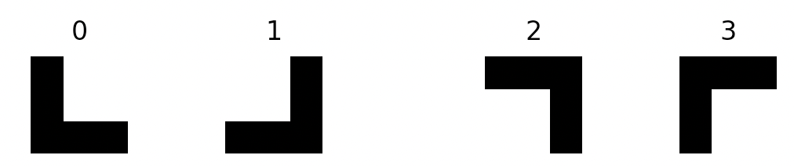
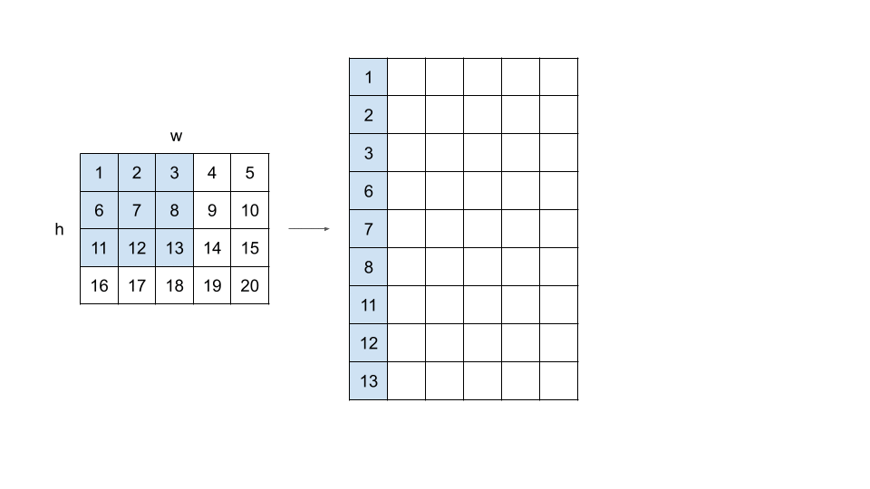
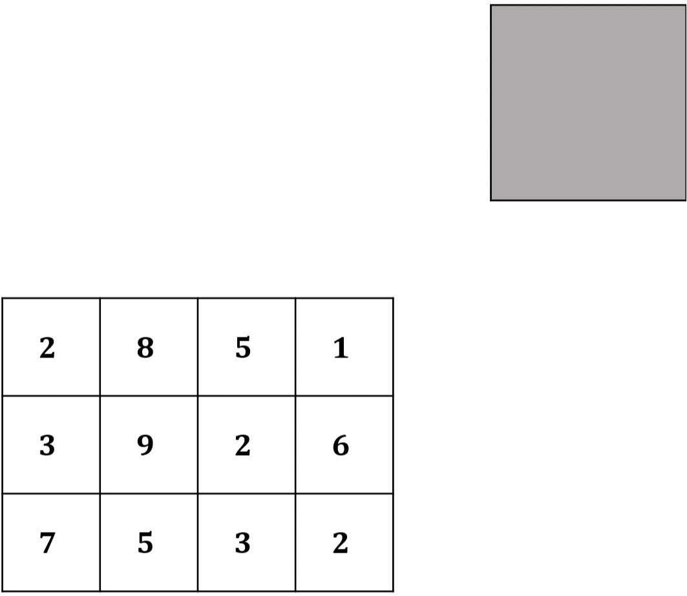

# 112-1 計算機程式設計 Quiz 2 題解

- 主題：陣列、函式(、浮點數)
- 雙數班(CSIE1210 02班)：2023/10/02(一) 2,3,4節(09:10-12:10)、後3題(10369-10371)
- 單數班(CSIE1210 01班)：2023/10/03(二) 7,8,9節(14:20-17:20)、前3題(10372-10374)

## 前言

上週老師出了點狀況(願一切安好)，導致課程進度全部延後一週，這次上課和考試的範圍因此從"array and floating point numbers"改為"array and function"。

話雖這麼說，單班的同學還是獲贈了一題浮點數+陣列的水題作為見面禮，不過只要你知道資料型態是`double`就變成秒殺題了，題敘甚至有很好心地告訴你輸入輸出要用`%lf`。再者，雖然單班和雙班各有一題函式模板題，但我覺得那兩題會設計成模板題也只是為了考函式語法，解題主要的思考還是會發生在陣列的使用。總而言之，這週的題在我眼中就是6題陣列題啦😛🤣！而且也只有考到二維陣列，不會像有些三維(以上)的陣列比較難debug，算是偏友善了。

關於函式這傢伙及其衍伸議題，我倒是有一些想法可以聊聊，但就留到結語再說吧！我們先來看看這週的題目與詳解囉。

## 詳解

### 10369. Mean and Variance

給定一組數據 $S = \lbrace x_1, x_2, \dots, x_n \rbrace$ ，請算出此數據的平均數 $\mu$ 和母體變異數 $\sigma^2$ 。

$$\mu = \frac{1}{n} \sum_{i=1}^{n} x_i$$

$$\sigma^2 = \frac{1}{n} \sum_{i=1}^{n} (x_i - \mu)^2$$

⚡ 一言以蔽之：1顆星都不到的水題，按照題目敘述的公式求出答案即可。注意所有的運算要用`double`，輸入輸出的format要用`%lf`。(我試過了，用`float`只有範例測資會過，正式測資全都會WA。)

⌨ 實作細節([參考AC code](10369.%20Mean%20and%20Variance.c))：
1. 第一次迴圈：輸入數據存進陣列，同時計算數據的總和。迴圈結束後，把總和除以數據個數得到平均數。
2. 第二次迴圈：再次跑過陣列裡的每一筆數據，利用剛才算出的平均數算出 $(x_i - \mu)^2$ 的總和。迴圈結束後，把總和除以數據個數得到母體變異數。

⭐ 難度：0.5 / 5

💡 我的解法：時間複雜度 $O(n)$ ，空間複雜度 $O(n)$

⏳ 我花的時間：5m22s

<details>
<summary>📝 題外話：</summary>

這一題的本意顯然是要考陣列，可是轉念一想，如果不要用題目給你的標準差公式，而是用高中學過的另一條公式 $\displaystyle \sigma^2 = \frac{1}{n}\sum_{i=1}^{n} x_i^2 - \mu^2$ 的話，那根本不用把數據存進陣列裡，因為用一次迴圈算出 $x_i$ 和 $x_i^2$ 的總和後，最後的除法和減法運算就不須用到原始的數據了。

我在打詳解的時候才發現這件事情，趁著judge關掉前的半小時試試看究竟會不會被卡，結果是10筆測資只有過6筆🤔。我心想：「這該不會是精度問題吧？」結果換成`long double`後還真的過了，有點好笑🤣。(詳見[有點小邪教的無陣列版AC code](10369.%20Mean%20and%20Variance%20(without%20array).c))
</details>

### 10370. L-Shaped Bricks in a Square Grid

給定一個 $n \times n$ 的方陣，裡面有數個L型木塊，其中是木塊的格子以 $1$ 表示，空白的格子以 $0$ 表示。今天給你每個L型木塊的轉角那格(水平翼和垂直翼相交那格)的座標，請你辨識出每個木塊的方向，以及他們水平翼與垂直翼的長度。輸出的順序必須按照轉角格的座標排列，依列遞增，同列者則依行遞增。

L型木塊的4種可能方向如下圖：



⚡ 一言以蔽之：只要會用任何一種排序演算法，並且掃描木塊長度時小心不要戳到陣列外面，就解決了。

⌨ 實作細節([參考AC code](10370.%20L-Shaped%20Bricks%20in%20a%20Square%20Grid.c))：
1. 我不確定邦邦有沒有教過排序，但大家都理論上會隨便一個 $O(n^2)$ 的排序演算法......吧！總之這題 $n$ 最大也才到 $100$ ，看似是沒有要在這卡大家。
2. 判木塊長度：
   - 我先定義 $d= 0, 1, 2, 3$ 分別代表右、上、左、下四個方向，往右是y軸正向，往下是x軸正向。
   - 建議開一個`length[4]`陣列記錄「以轉角格為中心，分別往右、上、左、下延伸的長度」。
   - 這樣就可以搭配一個小技巧：開兩個陣列`const int dx[4] = {0, 1, 0, -1};`和`const int dy[4] = {1, 0, -1, 0};`，`dx[d]`和`dy[d]`就代表往 $d$ 方向走一格的x和y座標偏移量。如此一來就可以用一個for跑過4種方向，其中使用通用的`x += dx[d]`和`y += dy[d]`代表往指定的方向移動一格，我覺得這樣有比4個方向各寫一個for乾淨啦。
   - 小心不要走到陣列外面，x和y座標的範圍都是 $[0, n)$ 。

⭐ 難度：1.5 / 5

💡 我的解法：時間複雜度 $O(n^2)$ ，空間複雜度 $O(n^2)$

⏳ 我花的時間：32m19s (我一開始沒看到要排序......這麼重要的資訊怎麼可以寫在Note底下啦😅)

### 10371. Polynomial Division

我們以陣列 $(n, a_n, a_{n-1}, \dots , a_1, a_0)$ 代表多項式 $a_n x^n + a_{n-1} x^{n-1} + \dots + a_1 x + a_0$ ，也就是說，第0個元素代表多項式的次數，剩下 $n+1$ 個元素代表各項係數(降冪排列)。零多項式以 $(0, 0)$ 表示。

請你實作下列的函式，參數 $f$ 和 $g$ 分別代表被除式和除式，算出 $f \div g$ 的商式和餘式後，以上述的規格分別存回 $f$ 和 $g$ 中。

```c
void dividePolynomial(int f[], int g[]);
```

⚡ 一言以蔽之：函式模板題，多項式陣列已經給你了。模擬國中學過的多項式的長除法即可，不過「要把答案存回原本的參數」會比較麻煩，要小心不能把之後還會用到的數據蓋掉，以及要花一些心思判斷餘式的次數。

⌨ 實作細節([參考AC code](10371.%20Polynomial%20Division.c))：
1. 開一個陣列存商式。把被除式`f`目前的最高次項除以除式`g`的最高次項得商，再把`f`扣掉商的這一項乘以除式的結果。這裡建議每除一項後就把`f`印出來，檢查有沒有除爛掉或減爛掉。
2. 整個除完後，`f`的最後 $\deg (g) - 1$ 項就會是餘式。判斷餘式次數的方式是：從可能是餘式的最高次項開始往後掃，如果在第`i`項遇到係數不是零就中獎了，此時就可以把`f[i]`到`f`最後的部分複製到`g[1]`(含)以後，同時算出次數存到`g[0]`。如果`f`剩下的係數全都是0，就代表整除，餘式為零多項式。這邊可以推論不會戳到陣列的記憶體外面，因為餘式的次數一定小於原本的除式。
3. 最後再把第1步的商式複製到`f`即可。(其實應該可以不用再開一個商式的陣列，但那樣會讓程式碼變得很醜，我也懶得試了。)

⭐ 難度：2 / 5

💡 我的解法：時間複雜度 $O((\deg f)^2)$ ，空間複雜度 $O(\deg f)$

⏳ 我花的時間：44m14s (我就是被「要把答案存回原本的參數」還有判斷餘式搞到有點煩躁，很多時候腦袋都在放空)

<details>
<summary>📝 題外話：</summary>

題目用兩個參數代表四筆資料，這點被邦邦說是「很爛的設計」，於是助教又被嗆了。
</details>

### 10372. Nearest Points II

給定坐標平面上 $n$ 個點 $x_0, x_1, \dots, x_{n-1}$ 及其坐標 $(r_0, c_0), (r_1, c_1), \dots, (r_{n-1}, c_{n-1})$ 。再給定一個點 $y$ 及其座標 $(r_y, c_y)$ ，請你求出點 $x_0, x_1, \dots, x_{n-1}$ 中，離點 $y$ 最近的所有點們，並輸出這些點的索引值(遞增序)。

⚡ 一言以蔽之：維護三個變數：答案陣列`indexes`、答案陣列的大小`size`以及目前的答案陣列所對應的最短 $\overline{x_i y}$ 距離`nearest_distance`。對於每個點 $x_i$ ，計算其與點 $y$ 的距離，依照大於、等於、小於`nearest_distance`三種情況分別處理。

⌨ 實作細節([參考AC code](10372.%20Nearest%20Points%20II.c))：
- 兩點間距離建議用距離的平方存，避免開根號後的浮點數誤差。
- 這裡的「陣列的大小」指的是實際儲存有效數據的範圍，因為你不確定答案會有幾個點，所以只能開大一點，然後自己維護實際有用到的大小。
- 如果 $\overline{x_i y}$ 小於`nearest_distance`，則更新`nearest_distance`為 $\overline{x_i y}$ 、把 $i$ 存到 `indexes[0]` 並且把`size`重設為 $1$ 。\
  如果 $\overline{x_i y}$ 等於`nearest_distance`，把 $i$ 存到 `indexes[size]` 然後把`size`加 $1$ 。\
  如果 $\overline{x_i y}$ 大於`nearest_distance`，什麼事都不做。

⭐ 難度：1.5 / 5

💡 我的解法：時間複雜度 $O(n)$ ，空間複雜度 $O(n)$

⏳ 我花的時間：11m52s

### 10373. Image to Column

給你一個 $h \times w$ 的矩陣，以及window的大小 $k$ ，請你以一個 $k \times k$ 的window掃過整個矩陣，並將每次覆蓋的部分攤平成一維陣列，存到輸出矩陣的一行中。掃描的方式為：最初window的左上角貼齊矩陣的左上角，接著window每次往右移動一格，若遇到邊界則回到貼齊左側並往下移動一格，重複直到window的右下角貼齊矩陣的右下角。(window我真不知道怎麼翻譯比較好)

$h=4, w=5, k=3$ 的範例如下圖：



輸入以函式參數的方式給你，輸出則是要存進函式的最後一個參數`colMatrix`：
```c
#define MAXH 100
#define MAXW 100
#define MAXK 10
void img2col(int h, int w, int k, int imgMatrix[MAXH][MAXW], int colMatrix[MAXK * MAXK][MAXW * MAXH]);
```

⚡ 一言以蔽之：用兩層迴圈枚舉window左上角的座標，裡面再用兩層迴圈枚舉window當前覆蓋的每一格，將數值複製到`colMatrix`裡的對應格。

⌨ 實作細節([參考AC code](10373.%20Image%20to%20Column.c))：
1. 外層的兩層迴圈要枚舉window左上角的座標 $(r, c)$ ，所以第一層迴圈是 $r = 0, 1, \dots, (h - k)$ ，第二層迴圈是 $c = 0, 1, \dots, (w - k)$ 。我們可以發現，當window的左上角落在 $(r, c)$ 時，這次window覆蓋到的範圍要存進`colMatrix`的第 $(r \times (w - k + 1) + c)$ 行裡。 (其實你也可以多開一個計數器，每次換下一個window就++，就不用推這個算式了。但我覺得目前的寫法還算直觀，而且可以省一個記憶體。)
2. 內層的兩層迴圈要枚舉相對於window左上角 $(r, c)$ 的座標 $(i, j)$ ，所以第三層迴圈是 $i = 0, 1, \dots, (k - 1)$ ，第四層迴圈是 $j = 0, 1, \dots, (k - 1)$ 。這樣我們要鎖定的格子就位在 $(r + i, c + j)$ ，而且這格的數值要存進`colMatrix`的第 $(i * k + j)$ 列裡。
3. 綜合1、2步，你會得到`colMatrix[i * k + j][r * (w - k + 1) + c] = imgMatrix[r + i][c + j];`，這樣就結束了。
   (你也可以枚舉每一格的座標本身 $(i, j)$ ，這樣就會變成 $i = r, r + 1, \dots, r + k - 1$ 和 $j = c, c + 1, \dots, c + k - 1$。這樣最後一步就會變成`colMatrix[(i - r) * k + j - c][r * (w - k + 1) + c] = imgMatrix[i][j];`。)

⭐ 難度：1.5 / 5

💡 我的解法：時間複雜度 $O(hwk^2)$ ，空間複雜度 $O(hwk^2)$ (嗎？我懶得分析了😅)

⏳ 我花的時間：橫跨2天，加起來1小時左右 (如果你沒寫過那麼多程式，可能反而不會花這麼久的時間......內幕請見題外話)

<details>
<summary>📝 題外話：</summary>

我9/26(二)晚上第一次讀題時，這題的題敘是長這樣的：
> Implement a function `img2col` that transforms an image into a column. Please refer to the following GIF for an illustration. We slide a $k \times k$ window over a $r \times c$ matrix representing the image. Your task is to flatten each matrix covered by the window into an array and store each array as a column in the output matrix.
>
> The `img2col` function takes five parameters: `r`, `c`, `k`, `imgMatrix`, and `colMatrix`.
>
> - `r` is the number of rows of the input matrix `imgMatrix`.
> - `c` is the number of columns of the input matrix `imgMatrix`.
> - `k` is the window size.
> - `imgMatrix` is a $r \times c$ matrix that stores the input image.
> - `colMatrix` is a $((r - k + 1) * (c - k + 1)) \times k^2$ matrix that stores the output.

「這題目有sense喔，用row跟column去敘述矩陣，沒有用x跟y欸！」很多人都用x跟y去描述矩陣的第一個和第二個維度，我每次看到都很頭痛，因為數學的坐標平面通常是把x軸正向指向右、y軸正向指向上；可是在表示電腦的矩陣時，我們通常會把row(列)正向定為向下、column(行)正向定為向右。

我偷笑著，心想這樣應該就很直觀，速戰速決的話應該可以提早下班吧。然而，花了10幾分鐘把很直觀的解法刻出來後，迎面而來的卻是非常莫名其妙的bug。我一直以為是我的索引值算錯，後來經過一陣debug，我才發覺是`main`裡面在搞鬼：

```c
#include <stdio.h>
#include "image2column.h"

int main() {
  int imgRows, imgCols;
  // ...
  int imgMat[MAXR][MAXC];
  // ...
  scanf("%d%d", &imgRows, &imgCols);
  // ...
  for (int i = 0; i < imgCols; i++) {
    for (int j = 0; j < imgRows; j++) {
      scanf("%d", &imgMat[j][i]);
    }
  }
  // ...
}
```

大家看出反直覺在哪了嗎？輸入for迴圈雖然是熟悉的先`i`再`j`，可是`i`是遍歷行數、`j`是遍歷列數，然後底下又是`imgMat[j][i]`啊😨！

「所以這樣代表輸入和圖片的第0列其實是存進`colMat[j][0]`......可是矩陣的第二個維度明明就是行啊？！」當時給的範例矩陣又是 $4 \times 4$ 的正方形，所以更難釐清孰行孰列了。早已歷經30分鐘debug，如今又被反直覺的行列搞得頭昏眼花的我，決定乾脆先跳過這題吧🙃。

於是，我(無情地)把這題先推給我另一個強者朋友。等我回過神來，他已經在群組中反應這個問題了。
> (友) 1:35 AM
> 想請問10373的row跟column是不是反了
> 如果c = numbers of columns，這樣水平方向上應該是有c個元素才對
>
> (助教) 3:54 AM
> 感謝，已修改10373的description

---

時間來到隔天的愛現大會，有鑑於週一彩排時過於緊張而完全無法正常唱歌，我在正式表演開始前選擇講點廢話，以舒緩我當時緊張無比的情緒。而那段廢話，就隱約透漏著驗這題(和下一題)驗到心態崩的歷程，並且以一句半開玩笑的「大家考試就......保重吧」作結😆😅。

表演結束後，因為唱歌唱爛掉而感到無地自容的我，選擇趕緊和朋友們離開系館，躲到BOT去以避開那股令人羞恥的氛圍。

朋友們打撞球的同時，我打開了電腦，看看修改過後的題敘和`main`是否變得直觀了呢？
> (...) Given an image with width $w$ and height $h$ (...) a $w \times h$ window representing the image (...)
> The `img2col` function takes five parameters: `w`, `h`, `k`, `imgMatrix`, and `colMatrix`.
> - `w` represent the width of the input matrix `imgMatrix`.
> - `h` represent the height of the input matrix `imgMatrix`.
>
> (...)

```c
#include <stdio.h>
#include "image2column.h"

int main() {
  int imgWidth, imgHeight;
  int colWidth, colHeight;
  // ...
  int imgMat[MAXW][MAXH];
  // ...
  scanf("%d%d", &imgWidth, &imgHeight);
  for (int i = 0; i < imgHeight; i++) {
    for (int j = 0; j < imgWidth; j++) {
      scanf("%d", &imgMat[j][i]);
    }
  }
  // ...
}
```

結果只是把row跟column改成width和height而已，輸入的地方還是沒變啊！！！這下更反直覺了，我還要思考哪一個維度是width、哪一個維度是height......😑。

不過，歷經一天當中閒暇時間的思考，我已充分體會到「以子之矛，攻子之盾」的道理：你的輸入是先行再列，那我的迴圈也全都給你先行再列啦🤪！這次debug 20多分鐘的付出，總算是換來了綠色的AC。([舊題敘的毒瘤AC code](/../7886f6b34da4ea9e3cecafa5695246ee0e6592c0/C2023%20For%20Strong/Quiz%202/image2column.h))

---

正當我以為我和這題的愛恨情仇到此為止之時，9/29(五)的下午1、2點左右，群組又傳來了一陣騷動。這次又有其他人反應row跟column可能會造成誤解，未料老師竟親自出馬來糾正題目的不妥之處......你猜對了！於是助教又被嗆了。

這裡我想特別提的是，老師提到一個我沒看過的名詞：[row major memory layout](https://en.wikipedia.org/wiki/Row-_and_column-major_order)。一查之下，我才赫然回想起去年參加的SITCON 2022，有個議程就有提到先`i`再`j`跟先`j`再`i`的效能差別，原來就是這個啊！

總之，我終於可以把code改成如今直觀的樣子了，也能收回先前對許多人說「考試不是很難啦......你們一定可以的啦！」時，背後隱含著「只是可能會寫到很煩躁而已」的心虛，真是皆大歡喜🎉。
</details>

### 10374. Eclipse

定義太陽是一個 $N \times M$ 的矩陣，其中元素的數值範圍為 $[1, 9]$ ；定義影子是一個 $L \times W$ 的矩陣，其中每個元素都是 $0$ 。

考慮一個xy平面，把太陽左下角的點坐標定為 $(0, 0)$ ，所以其餘三點的坐標分別為 $(0, N)$ 、 $(M, 0)$ 和 $(M, N)$ 。

給定最初影子左下角的點坐標 $(x, y)$ 、最大移動步數 $k$ 和每步長度 $s$ 。影子會從初始坐標開始持續向左下移動，最多移動 $k$ 步。而每次移動一步後，x、y坐標都會減少 $s$ ，所以從初始坐標開始考慮，移動一步後會來到 $(x - s, y - s)$ ，移動兩步後會來到 $(x - 2s, y - 2s)$ ，以此類推。

太陽沒被影子覆蓋的部分呈現原數值；被影子覆蓋的部分會則變成 $0$ ，ˇ等到影子不再覆蓋時恢復原數值。請你從太陽(有任一部分)被影子覆蓋的那一刻起，輸出太陽的樣貌，直到太陽被影子覆蓋的最後一刻，或是影子的步數用盡，兩者之中較早發生者為止。題目保證在步數用盡前，影子至少會碰到太陽一次。如果影子最初還沒移動任何一步，太陽就已經有被覆蓋到，那也要算一次輸出。

$(N, M, L, W) = (3, 4, 2, 2), (x, y) = (5, 4), s  = 1, k = 5$ 的範例如下圖：



⚡ 一言以蔽之：模擬影子的移動即可。不過要注意題目使用的坐標系，以及影子是否碰到太陽的判斷。

⌨ 實作細節([參考AC code](10374.%20Eclipse.c))：
1. 題目用的是數學常見的xy坐標系，而不是矩陣常用的rc坐標系，所以腦袋要轉一下。輸入太陽數值的每一列對應到的是同一個 $y$ 值，而且 $y$ 是遞減的，也就是說，第一列其實是對應 $y = N - 1$ ，最後一列是對應 $y = 0$ 。為了符合C語言的記憶體是[row-major order](https://en.wikipedia.org/wiki/Row-_and_column-major_order)的特性，建議把儲存太陽數值的矩陣的第一個維度訂為y坐標、第二個維度訂為x坐標，即`sun[i][j]`代表坐標 $(j, i)$ 的數值，這樣執行效率會比較高。
  另外一點是，題目給的都是點坐標，但我一律用格子的坐標去思考，比較貼近矩陣的思維模式。某個格子的坐標會和它那格左下角的點的坐標相同。
2. 影子一開始如果距離太陽很遠，一步一步模擬效率可能會很差。其實寫得好是勉強會過啦，可是寫爛的話保證吃TLE。仔細一想，我們發現可以可以用數學算出「影子最一開始要先走幾步才能碰到太陽」，然後就直接把影子拉過去。\
   假設最初要走`step`步才會碰到太陽，根據影子有機會碰到太陽的條件，我們會列出：<!-- GitHub's renderer is buggy when it comes to display math in lists. That's why I'm using inline math with manual breaks before and after the block as a workaround. -->\
   \
   $`\begin{cases}
   x - \text{step} \times s \lt M \\
   y - \text{step} \times s \lt N
   \end{cases}
   \Rightarrow
   \begin{cases}
   \text{step} \gt \frac{x - M}{s} \\
   \text{step} \gt \frac{y - N}{s}
   \end{cases}`$\
   \
   因此取 $\text{step} = \max\left(\lfloor\frac{x - M}{s}\rfloor, \lfloor\frac{y - N}{s}\rfloor\right) + 1$ ，即大於 $\frac{x - M}{s}$ 且大於 $\frac{y - N}{s}$ 的最小整數。如果算出來是負的，就代表影子一開始就已經碰到太陽了，這個時候要把`step`歸零。  
   結論是：我們一開始就直接先走`step`步，然後把影子拉到 $(x - \text{step} \times s, y - \text{step} \times s)$ 。這樣下一步就一定會碰到太陽，不用特別判斷「已經碰到太陽了沒」，就可以直接輸出答案。

3. 影子已經離開(再也不可能碰到)太陽的條件是：影子最右上方的那格 $(x + W - 1, y + L -1)$ 已經跑到太陽的最左下角的那格 $(0, 0)$ 的左方或下方，也就是 $x + W - 1 \lt 0$ 或 $y + L - 1 \lt 0$ 。這種情況下，就算還有剩下步數也要跳出迴圈。

⭐ 難度：2 / 5

💡 我的解法：時間複雜度 $O(n^3)$ ，空間複雜度 $O(n^2)$

⏳ 我花的時間：橫跨數天的好幾個小時 (這又是個慘痛的過程，詳見題外話......)

<details>
<summary>📝 題外話：</summary>

我最初解這題一心只想把題目的xy坐標系轉成我習慣的rc坐標系，因此在這上面卡了一段時間。不過這也倒還好，重點是我判斷兩個矩陣是否有重疊的條件式一直寫爛，同時又在思考怎麼寫出比較乾淨的程式碼，這才是我花了好幾個小時在這東西上的原因。所以不是題目的問題，事實上，題目的敘述從頭到尾都沒有改過，只是補上一些數值的範圍而已。

我的[第一版AC code](/../da1e6aaad7a6132e6dcc8ef5b4857693eeac18c4/C2023%20For%20Strong/Quiz%202/10374.%20Eclipse.c)就是用rc坐標系以及一個有點邪門的覆蓋判斷式通過的。到了當天晚上，我終於想通「只要調整輸入順序，就可以用`sun[x][y]`直接代表 $(x, y)$ 這格的數值」這件事，於是[第二版AC code](/../7886f6b34da4ea9e3cecafa5695246ee0e6592c0/C2023%20For%20Strong/Quiz%202/10374.%20Eclipse.c)誕生了，順便把覆蓋的判斷改成很直覺、漂亮的寫法。不過這時還是使用先`j`再`i`的順序輸入，而且是直接從最初開始暴力模擬每次移動，所以以效率而言離最佳解還差得遠呢。

[第三版AC code](/../54dd7e11ff2c3e2bcf7e0828b2c8d370bf86fe3e/C2023%20For%20Strong/Quiz%202/10374.%20Eclipse.c)就是套用了「直接把影子拉到第一次碰到太陽」的手法，不過出我意料的是，第6筆測資不管事上一版還是這一版的運行時間都偏慢，維持在320 ms左右。

時間來到寫這份詳解的同時，我才從上一題的討論中獲得靈感，發現應該是`j`再`i`在搞鬼。不過JudgeGirl已經關掉了，我只好自己生測資去測，結果還真的發現先`i`再`j`有比較快！難怪之前無論怎麼改都還是比別人慢，因為我看別人的code只有評估複雜度，沒想到迴圈的順序也有差。其實我最初有點排斥先`i`再`j`，就是因為這樣就要讓矩陣的兩個維度是y和x，導致`sun[i][j]`是代表坐標 $(j, i)$ ，有點反直覺。
</details>

## 結語

結果題外話不小心寫太多了，害我到了考試隔一天才寫完😅。

上次是單數班的題比較難，這次換成雙數班得題比較難，不過整體而言的難度和上週比起來也沒有突然變難很多，只是開始出現某些會讓人感覺煩躁的細節了。我聽說Eclipse那題好像只有30人左右滿分，等記分板出來後再看看整體的分布吧。

不知道什麼時候才會出現3.5星以上的題目呢？如果這門課的定位是C語法+一點點算法的課，搞不好整學期都不會吧🤔🤣！

喔對啦！我要講一點函式的東西。

---

愛現大會的當晚，沒吃晚餐的我在公館夜市覓食完後，選擇回到系館來看看傳說中的「民歌西餐廳」究竟是怎樣的場面。走進比想像中的熱鬧太多的地下室，我不知不覺就和幾個陌生的同學聊了起來，其中有幾個人半開玩笑地自嘲著「我計程要停修/被當了啦！」。

「我覺得**考試考很好**和**程式寫得很好**還是有一段差距的，因為有些考試的技巧是實際上很少用到的，而有些非常實用的東西卻是考試考不出來的......所以我覺得，學程式最重要的是**訓練自己解決需求與問題的能力**。」雖然這些話是以鼓勵別人為出發點而說出口的，但某種程度上這也是我學程式至今的感想之一。(當然基礎的語法是一定要先熟練啦，否則什麼程式也寫不出來。)

如果這聽起來很抽象，那就把它想成「寫數學段考考卷的計算過程」和「科展報告的計算過程」之間的差別：前者要在有限的時間內達成相對單純的目標—把答案算出來，而且自己看得懂就好了，後者則是要有架構地對他人呈現研究的成果，因此詳細度與工整度上自然會有所不同。填答案卷都快來不及了，哪有時間在那邊寫假設未知數，對吧？

回到程式，我認為函式就是這個現象最常見的例子之一。撇除掉那些一定要寫成函式，或是寫成函式會比較好思考的東西，典型的程式考題其實沒什麼機會讓函式發揮它的功用，又或者說，讓我們體會到函式的功用。我們連變數名稱可能都會亂取了，哪有時間去思考哪些東西要寫在函式裡，甚至是冒著函式寫爛還有可能會讓程式比較慢的風險，增加自己的debug負擔。

現實生活中的程式專案，格局可以比解題大上好幾十倍，這時候就真要花心思在「寫出乾淨、易維護」的程式上，因為你隨時都在用別人的程式，別人也隨時都在用你的程式。除此之外，別人也會在未來去看你過去寫的程式，你也會在未來看別人過去寫的程式，這時候如果跳出來的是`int xx = (aa + bb) / 2;`這種東西，沒氣到把咖啡潑在螢幕上就已經很好的修養了。

<b>函式最顯然的功能，就是把程式拆成許多小的、較易維護的部件。</b>引用一句Robert C. Martin說過的名言：
> Functions should do one thing. They should do it well. They should do it only.

但這又有什麼直接的好處？

如果一支程式**在許多地方都要用到某個功能**，並且滿足**這個功能很單一**，你就只要在刻函式時思考一次「要如何做到這個功能」，並且確定它沒有問題([unit testing](https://en.wikipedia.org/wiki/Unit_testing))，之後就可以直接使用了。如果某個環節出了bug，你會比較容易偵測到問題是出在哪個部分。就像你在寫題目時，應該不會去懷疑bug是出在C的standard library吧？

這種寫函式的靈感，大概是在我因為打解題競賽打不上去，而跑去做一些專案時才體會到的。實際上，只在一個地方被用到的程式也可以會寫成函式比較好，只要它滿足**功能單一**的條件，但這就有點要靠經驗去感覺了，我也還在學習當中。

總而言之，<b>我認為函式的使用本身就是一門藝術。</b>同樣都是為了達成某一個目標，實作上會有無數種函式間的拆分、組合和搭配的方法，也難怪重構是一門難以精熟的技能。

其實不只是函式，變數名稱要怎麼取比較好、語言內建的哪些功能是建議不要用的、documentation要怎麼寫比較易讀，這些都是我自己仍試圖精進的主題。業界不同的公司也都有不同的規範，我自己就常常在做專案時去看Google的[coding style guide](https://google.github.io/styleguide/)和[developer documentation style guide](https://developers.google.com/style/)。

---

好像又不小心把詳解當成文章在打了，總之就是一些想法，大家就隨意看看吧。而且打完我才發現，我沒有詳細提到「學程式最重要的是訓練自己解決需求與問題的能力」的部分，之後有契機的話再談吧😅。

希望大家除了考試考高分之外，也能寫出乾淨又易讀的程式！

— 2023/10/04 22:48
